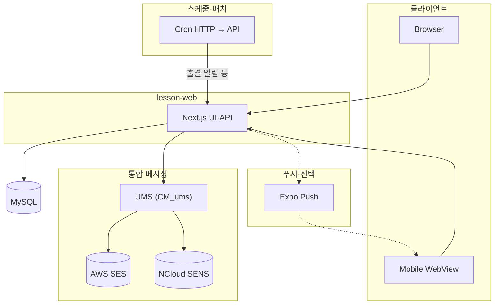
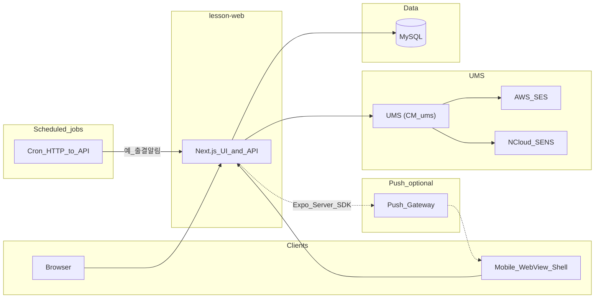
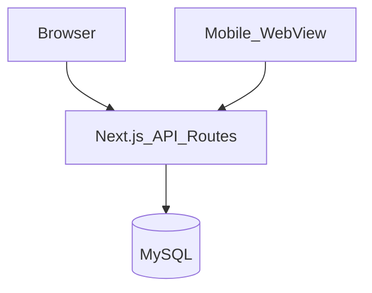
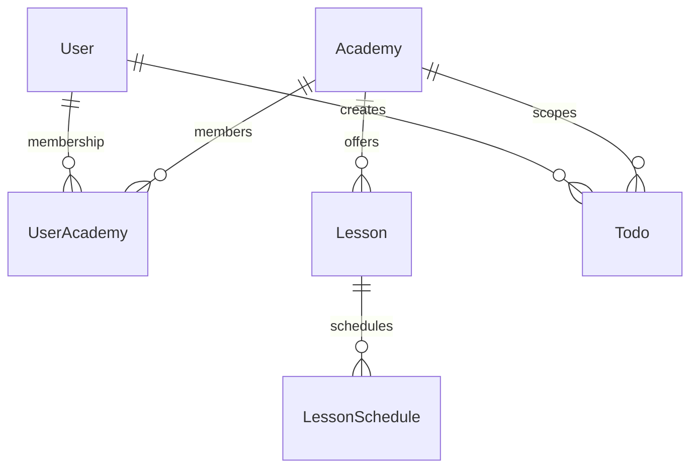
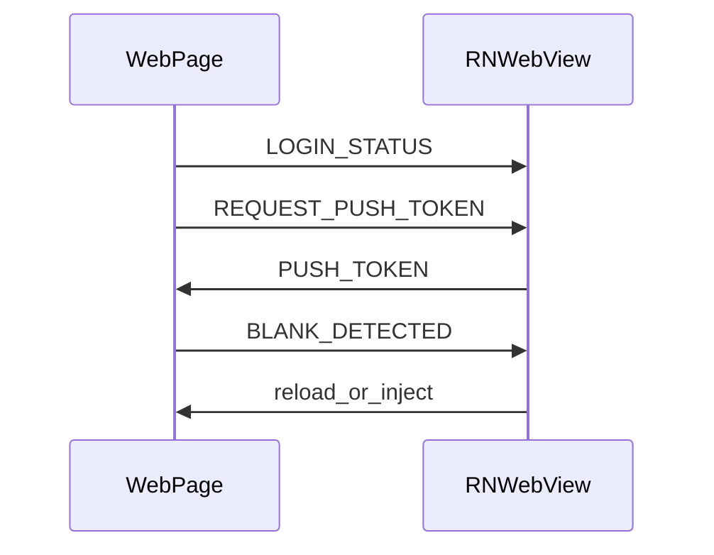

<div align="right">

[**← 프로필 README**](../README.md) · [**사이드 프로젝트 목록**](./README.md)

</div>

---

# 출결 관리 서비스 — 프로그램 설계 개요

학원(`Academy`) 단위 멀티테넌시로 수업·일정·출결 등을 다루는 웹·모바일 구조를 정리한 문서입니다. 클라이언트는 **웹**과 **모바일 WebView 셸** 두 저장소로 나뉩니다.

## 1. 수행 배경

테넌트(학원) 경계와 **역할·소속**을 Prisma 스키마에 얹어 보는 연습을 하고 싶었다. 날짜·스케줄·출결처럼 **시간축이 긴 도메인**을 API와 화면에서 같은 모델로 일관되게 쌓아 보는 것도 목표였다.

웹, **WebView 셸**, 푸시, (선택) 스케줄에서 HTTP로 API를 두드는 흐름까지 **짧은 풀스택 루프**를 한 저장소에서 돌려 보려고 진행했다.

---

## 2. 시스템 구성 요소

| 구분   | 디렉터리       | 역할                                                         |
| ------ | -------------- | ------------------------------------------------------------ |
| 웹     | `lesson-web`  | Next.js(App Router), Prisma·MySQL, NextAuth                  |
| 모바일 | `lesson-mobile`  | Expo WebView 셸, 푸시·OTA 등                                 |
| 통합 메시징 | `CM_ums` | **UMS**: 이메일(AWS SES)·SMS(NCloud SENS) — 가입·알림·고객지원 등 |

### 2.1 시스템 구성도

앱·DB·스케줄(HTTP)·**UMS**·푸시를 함께 표시합니다.



---

## 3. 아키텍처



- **역할**: 시스템·학원 관리자·부관리자·선생님·학생 등이 `Role`·`UserAcademy`에 따라 기능이 나뉩니다.
- **배치 연동**: 출석 알림 등은 HTTP로 API를 호출하는 스케줄 작업(`batch/*` 등)과 연동될 수 있습니다.
- **UMS**: 메일·SMS 발송은 **`UMS`** (`CM_ums`) → AWS SES·NCloud SENS 경로로 통합합니다.

---

## 4. 데이터 흐름

1. **계정·학원**: `User`가 `UserAcademy`로 학원에 소속되고, 학원별 프로필·승인 상태를 관리합니다.
2. **수업·일정**: `Class`, 담당(`TeacherClass` 등), `ClassSchedule`, 출결·수업 이력 API가 갱신·조회를 담당합니다.
3. **업무 보조**: 학원 단위 `Todo`·`Note`, 코드 마스터(`CodeGroup`·`Code`), 시스템 콘텐츠·FAQ, 문의(`SupportInquiry`) 등.
4. **내부 결제**: 학원 운영 관련 내부 `Payment`는 스키마에 정의되어 있으며, 화면·API는 도메인 설계에 맞게 사용합니다.

스키마 전체는 `lesson-web/prisma/schema.prisma`를 기준으로 합니다.

### 4.1 요청·저장 흐름(도식)



### 4.2 핵심 엔티티 관계(요약)



도식의 `Lesson`·`LessonSchedule`은 Prisma의 `Class`·`ClassSchedule`과 같습니다.

---

## 5. 웹 애플리케이션 레이어 (`lesson-web`)

### 5.1 기능 영역(예)

- 온보딩·학원 선택, 대시보드(통계·노트·할 일 등)
- 관리자: 학원·반·학생·선생님·출결·결제·알림·설정·콘텐츠·FAQ
- 선생님: 대시보드, 수업·학생·일정·출결·메모
- 공통: 코드 조회, 학원 검색, 프로필·비밀번호·탈퇴, 푸시·업로드 토큰, 고객 문의

---

## 6. 모바일 앱 레이어 (`lesson-mobile`)

### 6.1 WebView 브릿지(요약)



---

## 7. 디렉터리 구조(루트)

```
lesson-monorepo/
├── lesson-web/
├── lesson-mobile/
└── ReadMe.md
```

---

## 8. 기술 스택 요약

| 영역 | 기술 |
| ---- | ---- |
| 웹   | Next.js 16, React 19, Prisma, MySQL, NextAuth, Mantine, Recharts 등 |
| 앱   | Expo, React Native, WebView |

---

## 9. 마치며

**어려웠던 점:** 학원·역할·코드 마스터가 겹치면서 권한 체크와 화면별 노출 조건이 분기로 늘어났다. 수업 일정 예외·보강·공휴일 등 **달력 도메인**을 API와 리포트 집계에서 동일한 기준으로 맞추는 데 설계가 필요했다. WebView 로그인 동기화와 푸시 토큰 갱신도 환경마다 디버깅 비용이 있었다.

**성과:** `Academy` 중심 멀티테넌시와 `UserAcademy` 역할을 스키마에 고정해, 이후 화면을 추가해도 **동일한 인가 모델**로 확장할 수 있게 했다. 월·기간 단위 집계·대시보드와 관리자·강사 뷰를 같은 API 계약 위에서 맞춘 점이 성과다. 레슨 도메인용 WebView 셸·브릿지 패턴은 다른 프로젝트와도 개념을 공유할 수 있을 정도로 정리했다.

