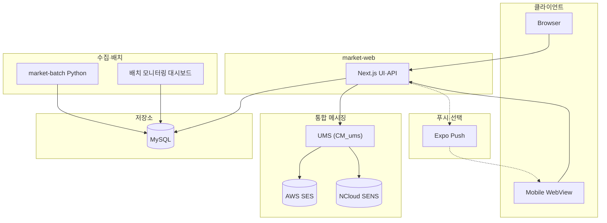
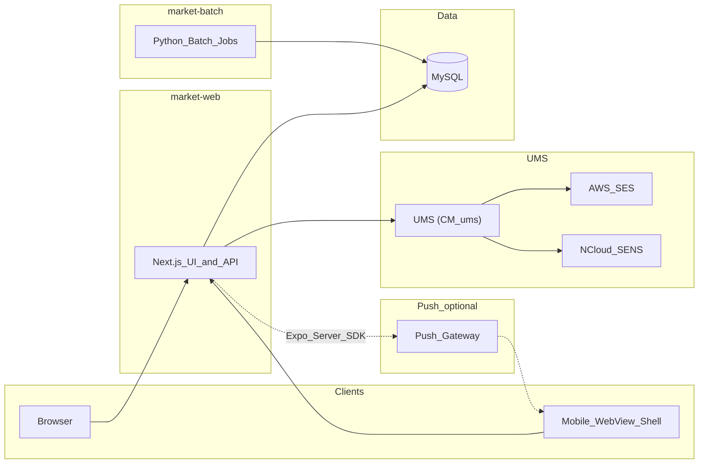
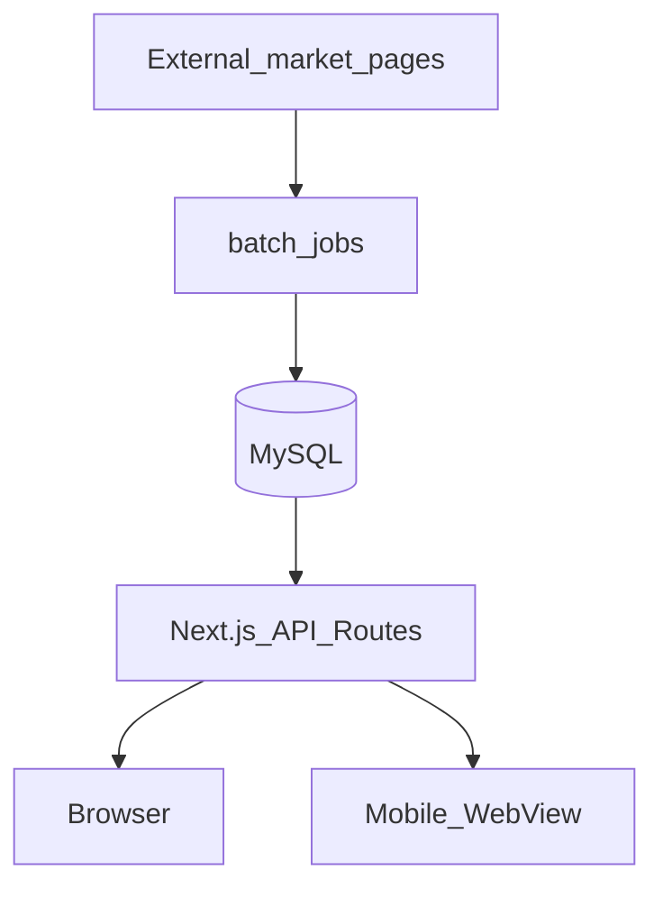
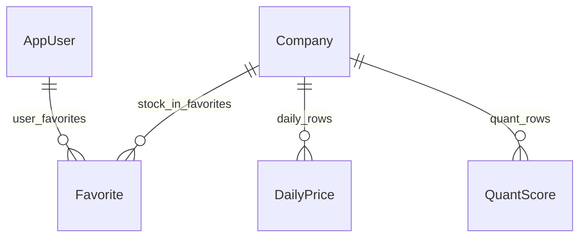
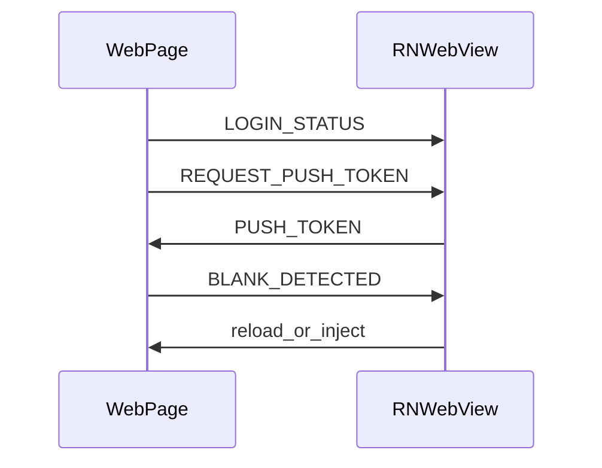

<div align="right">

[**← 프로필 README**](../README.md) · [**사이드 프로젝트 목록**](./README.md)

</div>

---

# 투자 데이터 서비스 — 프로그램 설계 개요

시세 수집·저장, Next.js·Prisma 웹, Expo WebView, Python 배치를 한 모노레포에서 다루는 구조를 정리한 문서입니다.

## 1. 수행 배경

Python으로 돌리는 수집·스코어링 배치와, 같은 MySQL 스키마를 바라보는 Next.js(App Router)·Prisma 레이어를 **한 흐름으로 이어 보고** 싶었다. 시계열을 차트·표로 노출하는 API·UI 설계를 직접 맞춰 보며, 데이터 레이어와 표현 레이어의 경계를 경험하는 것이 목표였다.

모바일은 **단일 웹을 WebView로 싣는 패턴**과 푸시·OTA 연동을 한 저장소 안에서 시도해 보고자 했다. 잡 정의·실행 이력을 DB 메타로 두고 `node-cron` 러너와 소규모 운영 UI로 묶는 **배치 모니터링**은, 범용 스케줄러만으로는 맞추기 어려운 **관측·재실행** 요구를 **직접 설계하며** 스키마와 권한 경계를 실험하는 성격이 컸다.

---

## 2. 시스템 구성 요소

| 구분   | 디렉터리      | 역할                                                                                        |
| ------ | ------------- | ------------------------------------------------------------------------------------------- |
| 웹     | `market-web` | Next.js(App Router) UI 및 API Routes, Prisma·MySQL, NextAuth 기반 인증                      |
| 모바일 | `market-mobile` | Expo(React Native) 앱. 전체 화면 WebView로 웹을 로드하고 푸시·OTA·뒤로가기 등 네이티브 연동 |
| 배치   | `market-batch` | 종목 마스터·일별 시세 수집, 베팅 채점·모니터링 등 스크립트와 셸 배치                        |
| 운영·모니터링(자체) | (동일 모노레포 내) | **배치 모니터링 대시보드**: 잡 등록·스케줄 실행·이력 조회, `node-cron` 러너와 DB 메타 공유·API 연동 |
| 통합 메시징 | `CM_ums` | **UMS**: 이메일(AWS SES)·SMS(NCloud SENS) — 가입·비밀번호 재설정·운영 알림 등 (웹 API에서 패키지 연동) |

### 2.1 시스템 구성도

클라이언트·앱 서버·데이터·수집·배치 운영·**통합 메시징(UMS)**·푸시의 관계를 한눈에 보도록 정리했습니다.



---

## 3. 아키텍처



- **클라이언트**: 브라우저는 웹에 직접 접속합니다. 모바일 앱은 동일 웹을 WebView로 표시합니다.
- **서버**: Next.js가 페이지 렌더링과 REST형 API를 담당하며 Prisma로 MySQL에 접근합니다.
- **배치**: 봇이 외부 시세 소스에서 데이터를 가져와 DB를 갱신합니다. 웹은 이 DB를 읽습니다.
- **푸시**: 서버에서 Expo Server SDK 등을 통해 푸시 게이트웨이로 전송하고, 기기는 네이티브 알림으로 수신합니다. WebView 로드 URL·푸시 등록 엔드포인트는 배포 환경에 맞게 앱·서버 설정으로 둡니다.
- **UMS**: 인증·알림 메일·SMS는 **`UMS`** (`CM_ums`) 패키지로 통합하여 AWS SES·NCloud SENS를 호출합니다.

---

## 4. 데이터 흐름

1. **수집**: 배치가 `Company`(종목 마스터), `DailyPrice`(일별 가격·지표), `QuantScore`(전략별 퀀트 점수·메타데이터) 등을 갱신합니다.
2. **조회·가공**: 웹 API가 동일 스키마를 조회해 대시보드, 일일 시세, 우량주 후보(`/api/quality-stocks` 등), 시장 지수·랭킹 등을 제공합니다.
3. **사용자 데이터**: `AppUser`, `Favorite`, `Bet`, `Holding`, `PushToken`, `UserStrategy`, 전략 마스터 `Strategy` 등으로 계정·관심종목·베팅·보유·알림·전략 연동을 표현합니다. 상세 필드는 `market-web/prisma/schema.prisma`를 기준으로 합니다.

대시보드의 저·고평가 우량주·급등주 등은 **퀀트 점수(전략별 메타데이터)와 일별 시세**를 조합한 API 단일 소스에서 일관되게 계산합니다. 세부 임계값·정렬 규칙은 `market-web/README.md`의 해당 절을 참고하면 됩니다.

### 4.1 데이터 파이프라인(도식)



### 4.2 핵심 엔티티 관계(요약)



---

## 5. 웹 애플리케이션 레이어 (`market-web`)

### 5.1 주요 화면(예)

- 대시보드, 일일 시세, 관심종목, 전략, AI 분석, 예측, 베팅, 내 정보, 인트로
- 로그인·회원가입·비밀번호 찾기·재설정
- 모니터링 등 일부 화면은 역할에 따라 접근이 제한됩니다.

### 5.2 인증·보호(시큐어 코딩)

- **세션·접근 통제**: NextAuth 세션과 `middleware.ts`로 공개 경로와 보호 경로를 구분합니다.
- **역할**: 토큰의 역할에 따라 일부 관리 전용 경로 접근을 제한합니다.
- **비밀번호**: 평문 저장 없이 **단방향 해시**(예: bcrypt, Argon2 등)로 저장·검증합니다. 찾기·재설정용 토큰은 일회성·만료·추측 어려운 값으로 발급합니다.
- **개인정보**: 식별·연락처 등 민감 필드는 **애플리케이션 수준 암호화** 등으로 보관하고, 키는 환경·비밀 관리로 분리합니다. 로그·에러에 평문이 남지 않도록 합니다.

---

## 6. 모바일 앱 레이어 (`market-mobile`)

### 6.1 WebView 브릿지(메시지 흐름, 요약)



- **WebView**: 프로덕션 웹 URL은 `App.js`의 `source.uri` 및 배포 설정에서 지정합니다. 문서에는 고정 URL을 적지 않습니다.
- **브릿지**: `injectedJavaScript`와 `onMessage`로 `localStorage`의 `userId` 기반 로그인 상태를 네이티브에 전달합니다. 웹에서 `REQUEST_PUSH_TOKEN` 등 메시지 타입으로 토큰·기기명을 주고받습니다.
- **안정성**: 로드 실패 재시도, iOS WebView 프로세스 종료 시 복구, 주기적 빈 화면 감지 후 reload, 백그라운드 복귀 시 OTA 업데이트 확인 등이 포함됩니다.
- **푸시**: `expo-notifications`로 권한·토큰을 얻고, 로그인 사용자 ID와 함께 서버에 등록합니다(엔드포인트는 서버·앱 설정에 따름).

---

## 7. 배치·운영 (`market-batch`)

- **`collect/`**: `ccl.py`(종목 리스트: KOSPI·KOSDAQ·ETF/ETN 등), `cdp.py`(일별 시세). 셸 스크립트 `collect/ccl.sh`, `collect/cdp.sh`로 cron 연동 가능합니다.
- **`bet-scoring/`**: 베팅 채점·봇 로직(`betting_scoring.py`, `betting_bot.py`) 및 대응 셸 스크립트.
- **`monitoring/`**: 모니터링 스크립트(`monitor.py`) 및 `monitor.sh`.
- **공통**: `share/config.py`, `share/db.py` 등에서 DB 연결·로깅·에러 처리를 공유합니다.
- **로그**: `log/{환경}/collect/`, `log/{환경}/bet-scoring/`, `log/{환경}/monitoring/` 등 하위에 일자별 로그가 쌓이는 패턴을 사용합니다.

자세한 실행 예·크론 샘플은 `market-batch/README.md`를 참고합니다.

### 7.1 배치 모니터링 대시보드(자체 개발)

Python 수집 루틴은 **데이터 정합성**에 초점을 두고, **운영 시야**는 별도 레이어로 두었습니다. 이 문제를 풀기 위해 다음을 **직접 구현**했습니다.

- **운영자 웹(Next.js)**: 로그인·대시보드·잡 등록·수동 실행·실행 이력·실패 알림 조회 등 API와 화면.
- **배치 러너(node-cron)**: MySQL에 저장된 잡 정의(스케줄·핸들러 식별자)를 읽어 주기 실행; 필요 시 외부 HTTP/DB 후속 호출.
- **공유 메타(MySQL)**: 잡 스펙·실행 로그·상태가 웹과 러너 간 단일 소스가 되도록 스키마를 맞춤.

이렇게 **배치 프로그램(스케줄 실행 본체)과 모니터링 UI**를 한 흐름으로 묶어, 투자 데이터 서비스의 수집·분석 파이프라인 운영 부담을 줄이는 것이 목표입니다.

---

## 8. 디렉터리 구조(루트)

```
market-monorepo/
├── market-web/     # Next.js + Prisma + MySQL
├── market-mobile/     # Expo WebView 셸
├── market-batch/     # Python 수집·배치
└── ReadMe.md        # 본 문서
```

---

## 9. 기술 스택 요약

| 영역  | 기술                                                                               |
| ----- | ---------------------------------------------------------------------------------- |
| 웹    | Next.js 16, React 19, TypeScript, Tailwind CSS 4, Prisma, MySQL, NextAuth          |
| 웹 UI | Radix UI, Framer Motion, Recharts, lightweight-charts 등                           |
| 앱    | Expo 54, React Native 0.81, react-native-webview, expo-notifications, expo-updates |
| 봇    | Python 3.8+, SQLAlchemy, pymysql(또는 프로젝트 `requirements.txt` 기준)            |

---

## 10. 마치며

**어려웠던 점:** 외부 시세·소스 페이지 구조가 바뀔 때 수집 스크립트와 재시도·백오프 전략을 계속 맞춰야 했다. Python 배치·`node-cron` 러너·웹이 같은 MySQL을 쓰는 구간에서는 잠금·실행 순서·멱등 처리를 설계하는 데 시간이 들었다. 시계열·랭킹 API는 페이지네이션·집계 비용과 응답 지연 사이에서 튜닝이 필요했고, iOS WebView 프로세스 재시작·빈 화면 같은 네이티브 쪽 이슈도 병행해 다뤘다.

**성과:** 수집 파이프라인과 읽기 API·화면을 **한 스키마와 모노레포**로 묶어 데이터 흐름을 추적하기 쉽게 만들었다. 배치 잡 정의·이력을 DB 메타로 통일하고 운영 UI와 러너를 연결해 **관측·수동 재실행**을 한 경로로 모은 점이 의미 있었다. WebView 브릿지·푸시 등록 패턴도 문서화해 재사용 가능한 형태로 정리했다.

