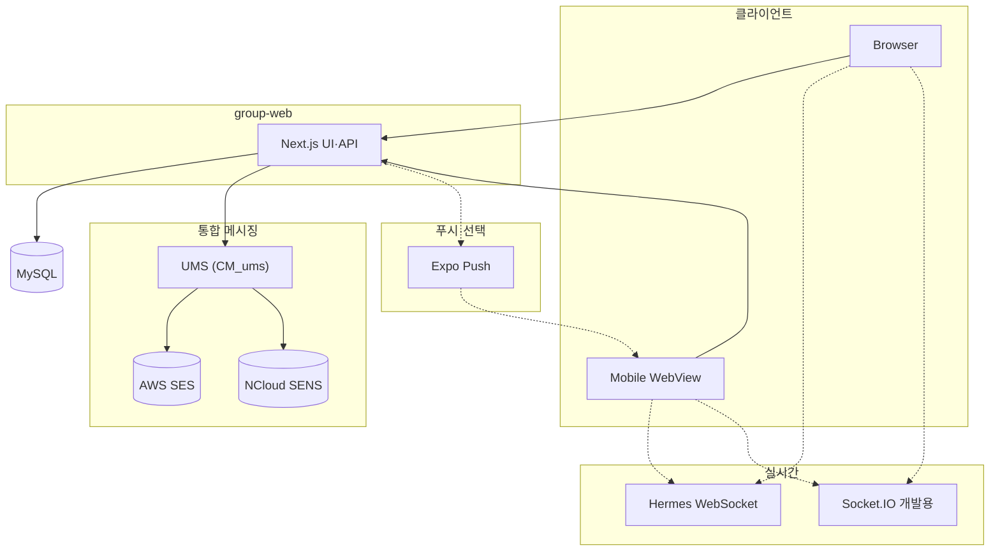
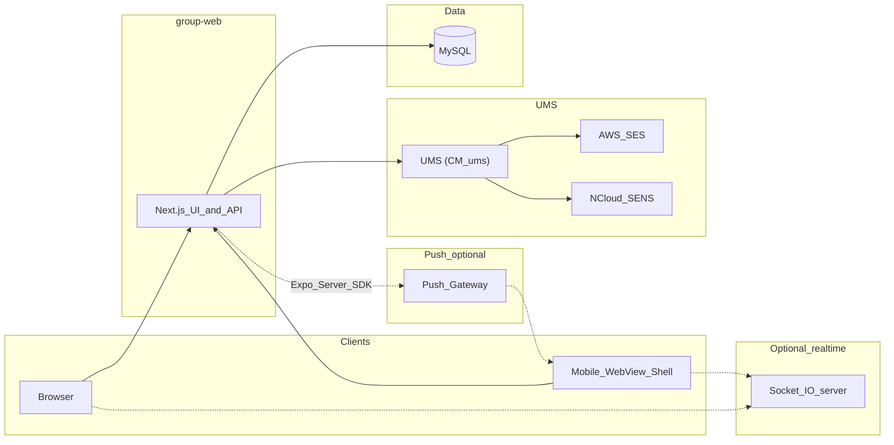
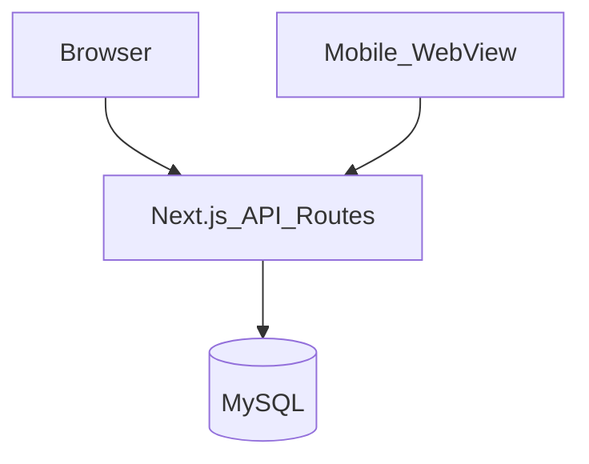
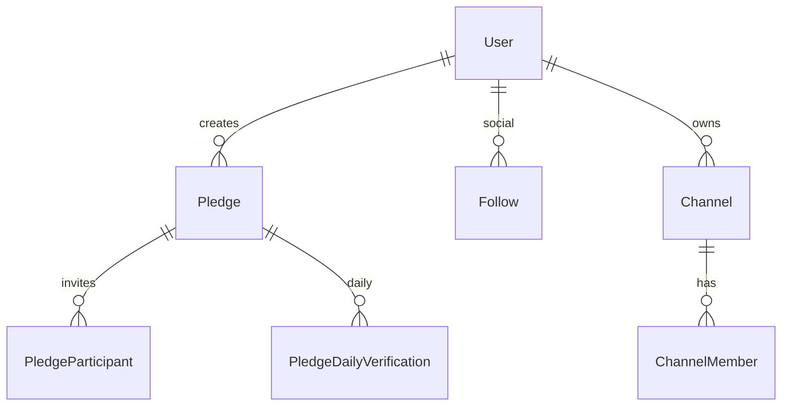
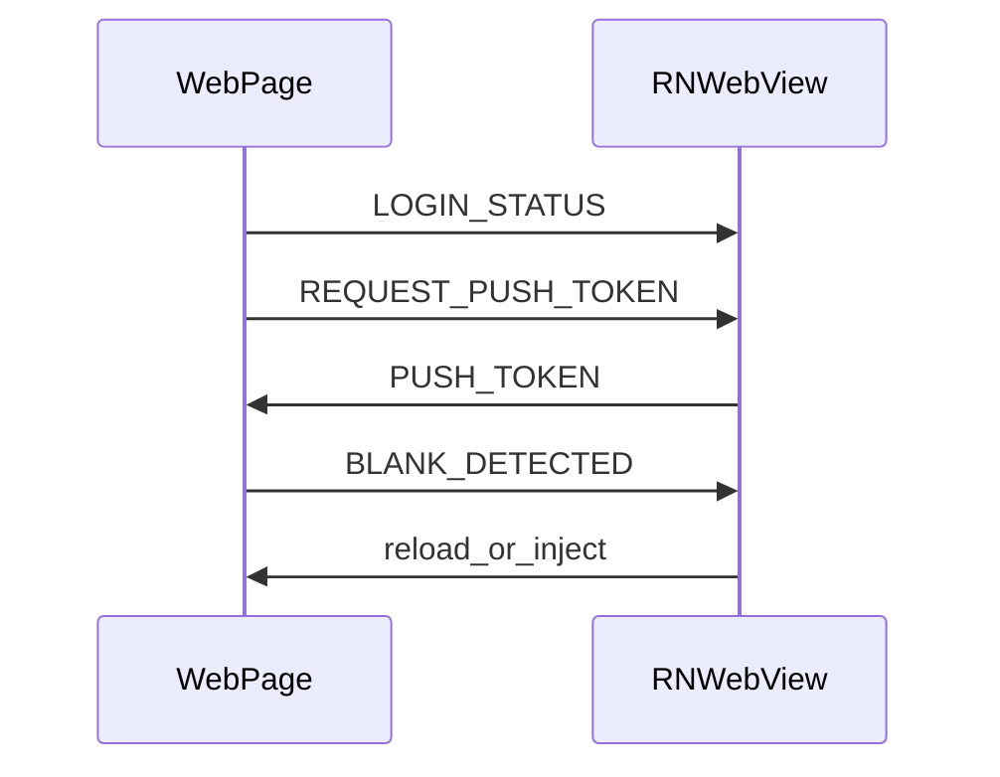

<div align="right">

[**← 프로필 README**](../README.md) · [**사이드 프로젝트 목록**](./README.md)

</div>

---

# 팀 협업 툴 — 프로그램 설계 개요

일일 인증·그룹·소셜·채널·채팅을 담는 Next.js 서비스와 Expo WebView 구조를 정리한 문서입니다.

## 1. 수행 배경

채팅·채널에서 **지연·재연결·백그라운드 복귀 뒤 상태 어긋남**을 다루기 위해, 개발 시에는 **Socket.IO**로 빠르게 검증하고, 운영 경로에서는 **별도 WebSocket 게이트웨이(Hermes)** 로 방·구독·브로드캐스트·하트비트·스냅 동기화를 분리해 보고 싶었다. 실시간 전송과 **REST·세션(또는 단기 서명 토큰)** 사이의 책임을 직접 나눠 보는 것이 목적이었다.

NextAuth v5 베타, 팔로우·댓글 등 **소셜 그래프**를 과도한 분산 없이 한 API·DB 레이어에 유지하는 설계도 시도해 보았다.

---

## 2. 시스템 구성 요소

| 구분        | 디렉터리          | 역할                                                                 |
| ----------- | ----------------- | -------------------------------------------------------------------- |
| 웹·API      | `group-web`  | Next.js(App Router), Prisma·MySQL, NextAuth v5 베타, REST API        |
| 모바일      | `group-mobile`  | Expo WebView 셸                                                      |
| 실시간(선택) | npm 스크립트      | `npm run socket` — Socket.IO 서버(Express) 별도 기동, `dev:all`로 웹과 병행 가능 |
| 실시간(자체) | **Hermes** (WebSocket) | 프로덕션 지향 **자체 WS 게이트웨이**: 채팅·채널 이벤트 라우팅, 연결 유지·재연결 복구 |
| 통합 메시징 | `CM_ums` | **UMS**: 이메일(AWS SES)·SMS(NCloud SENS) — 가입·비밀번호·알림 등 |

### 2.1 시스템 구성도

실시간(Hermes / Socket.IO)·REST·DB·**UMS**·푸시를 함께 표시합니다.



---

## 3. 아키텍처



- **REST**: 대부분의 CRUD·인증은 Next.js API Routes와 Prisma로 처리합니다.
- **실시간**: 채팅 등은 클라이언트가 Socket.IO 서버에 별도 연결하는 구조입니다(포트·호스트는 환경 설정). 운영 시에는 **Hermes WebSocket**으로 동일 도메인의 실시간 부하를 받아 REST와 인증 경계를 유지합니다.
- **외부 연동**: 이메일·SMS는 **`UMS`** (`CM_ums`)로 AWS SES·NCloud SENS에 통합합니다. 파일 업로드·WebAuthn 등은 라이브러리 및 환경 변수로 구성됩니다.

---

## 4. 데이터 흐름

1. **계정**: `User`·`Account`·`Session`, WebAuthn `Authenticator`, 비밀번호·이메일 찾기.
2. **공약**: `Pledge`·참가자·`SubTodo`·일일 인증(`PledgeDailyVerification`·사진)·협업 그룹·공유 인증.
3. **소셜**: `Follow`·`Like`·`Comment`, 차단 조회(`PledgeDeniedViewer`), 완료·랭킹 API.
4. **채널·채팅**: `Channel`·`ChannelMember`, 채팅 API와 Socket.IO가 함께 사용될 수 있습니다.
5. **기타**: `FavoriteGroup`, `Notification`, `LiveStream`, 추천 템플릿 등.

상세는 `group-web/prisma/schema.prisma`를 참고합니다.

### 4.1 요청·저장 흐름(도식)



### 4.2 핵심 엔티티 관계(요약)



---

## 5. 웹 애플리케이션 레이어 (`group-web`)

### 5.1 기능 영역(예)

- 공약 생성·수정·초대·일일 인증·서브 할 일·협업 그룹
- 피드·좋아요·댓글·신고, 팔로우·친구, 완료 목록·랭킹
- 채널·채팅(REST + 실시간)
- 알림·설정·업로드 토큰·추천 템플릿

### 5.2 인증·보호(시큐어 코딩)

- **세션·역할**: NextAuth와 미들웨어·라우트 보호로 공개·보호·관리 영역을 나눕니다.
- **비밀번호**: 평문 저장 없이 **단방향 해시**(예: bcrypt, Argon2 등)로 저장·검증합니다. 이메일·비밀번호 찾기 토큰은 일회성·만료를 전제로 합니다.
- **개인정보**: 계정·연락처 등 민감 데이터는 필요 시 **필드 단위 등 암호화**로 저장하고, 키는 환경·비밀 저장소에 둡니다. 로그에 주민번호·연락처 등이 노출되지 않게 합니다.
- **UMS**: 가입·비밀번호·알림용 이메일·SMS는 **연속 발송 방지**(쿨다운, 발송 간격·일일 한도), **rate limit**(계정·IP 등)으로 스팸·오남용을 막고, 검증은 서버에서 수행합니다.

---

## 6. 모바일 앱 레이어 (`group-mobile`)

### 6.1 WebView 브릿지(요약)



---

## 7. 디렉터리 구조(루트)

```
group-monorepo/
├── group-web/
├── group-mobile/
└── ReadMe.md
```

---

## 8. 기술 스택 요약

| 영역 | 기술 |
| ---- | ---- |
| 웹   | Next.js 16, React 19, Prisma, MySQL, NextAuth 5 beta, Mantine, Socket.IO, Express, SimpleWebAuthn, Twilio 등 |
| 앱   | Expo, React Native, WebView |

---

## 9. 마치며

**어려웠던 점:** 실시간 메시지의 **중복·순서·누락**을 클라이언트·서버 어디에서 감쌀지 정하는 일이 까다로웠다. Socket.IO 개발 경로와 Hermes 운영 경로를 나란히 두면서 환경 변수·인증 토큰 주입 방식을 맞추는 것도 부담이었다. NextAuth v5 베타는 마이그레이션·세션 쿠키 동작을 따라가며 시행착오가 있었다.

**성과:** **WebSocket 전송**과 **REST·Prisma 영속 데이터**의 경계를 문서 수준에서 분리해, 채팅 장애 시에도 계정·채널 메타는 안정적으로 남도록 했다. 방·멤버·브로드캐스트 모델을 한 번 정리해 두어 이후 기능을 얹을 때 확장 축이 명확해졌다. 개발용 Socket.IO와 Hermes를 병행해 **동일 UX를 두 경로에서 검증**할 수 있게 한 것도 의미 있었다.

