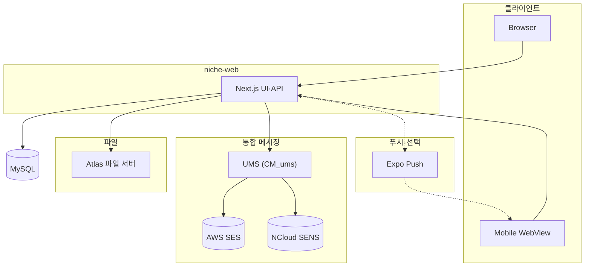
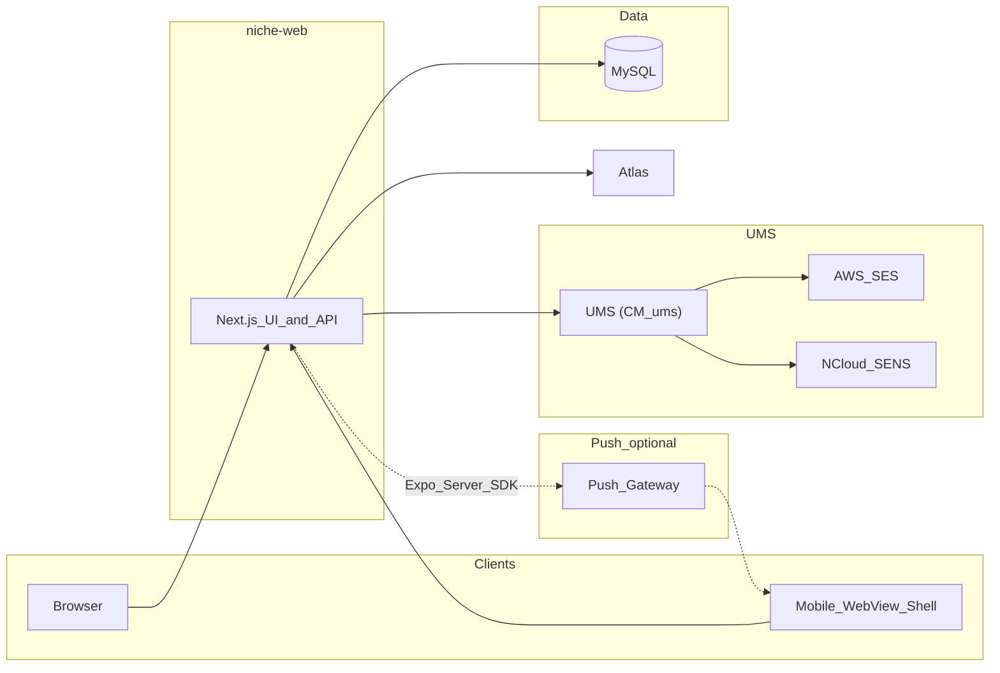
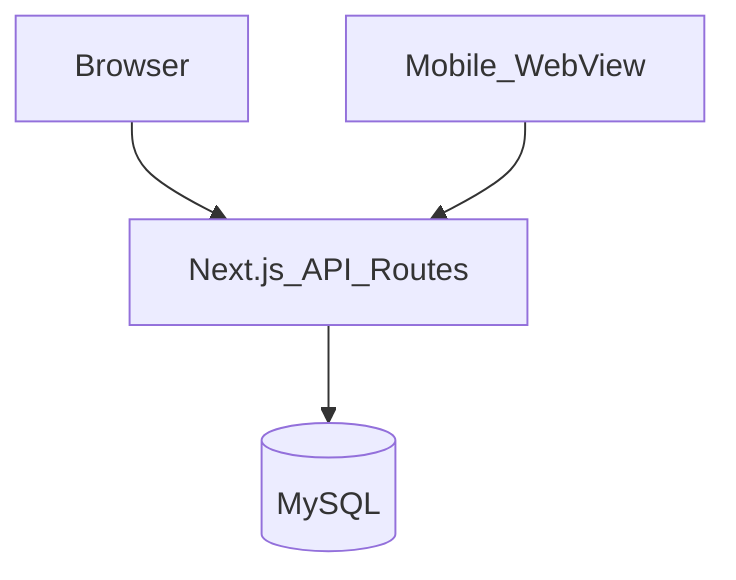
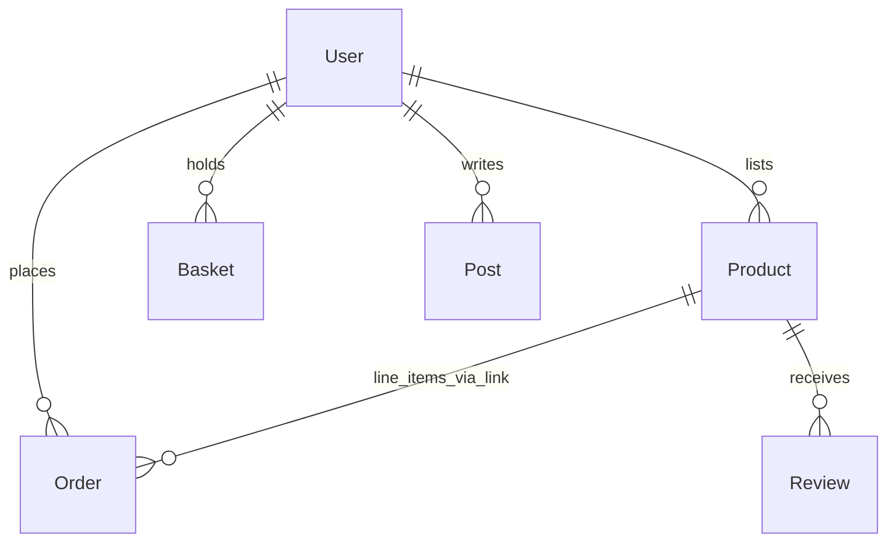
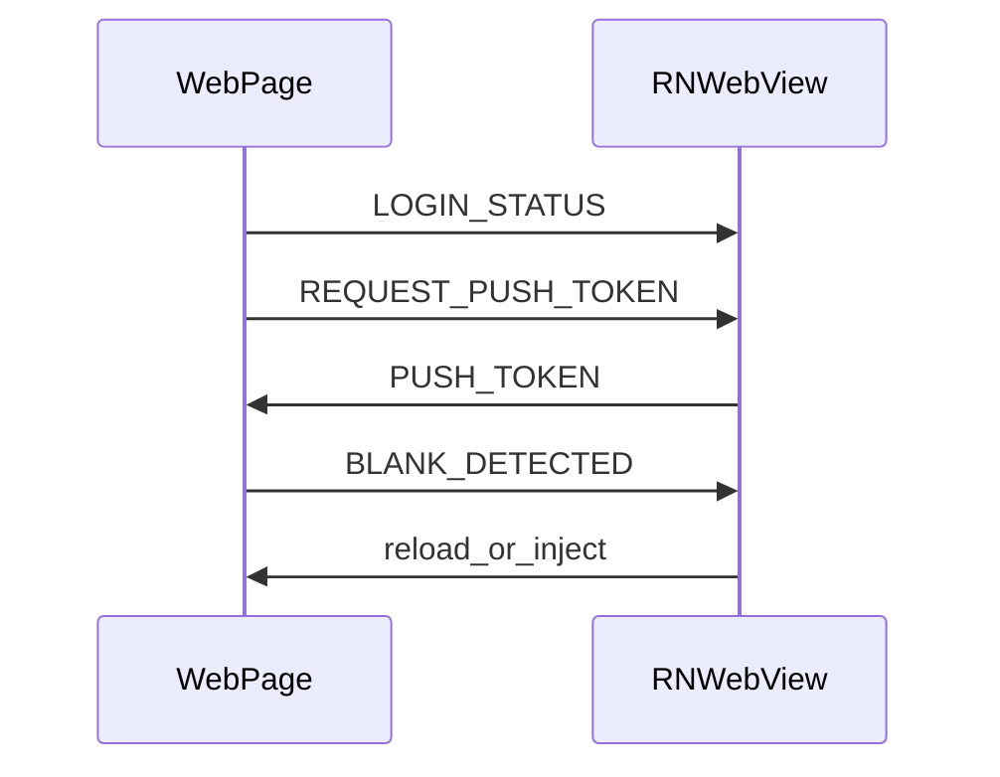

<div align="right">

[**← 프로필 README**](../README.md) · [**사이드 프로젝트 목록**](./README.md)

</div>

---

# 이커머스 서비스 — 프로그램 설계 개요

상품·주문 흐름과 커뮤니티(게시·댓글)를 한 Prisma 스키마와 Next.js 앱에서 다루는 구조를 정리한 문서입니다. 저장소는 **웹**과 **모바일 WebView 셸**입니다.

## 1. 수행 배경

**장바구니·주문·결제 상태**처럼 트랜잭션 성격이 강한 모델과 **게시·리뷰**를 한 스키마에 같이 얹어, 도메인 경계와 마이그레이션 전략을 **직접 맞춰 보고** 싶었다. 관리자·쿠폰 등 부가 레이어를 같은 코드베이스에 얹는 연습도 포함했다.

이미지·첨부가 많아질 때 웹 워커에 부담을 주지 않도록 **업로드 수락·저장·썸네일·서명 URL**을 담는 **자체 파일 서버(Atlas)** 를 구현해, HTTP API와 바이너리 저장 사이의 **책임 분리**를 경험해 보고자 했다.

---

## 2. 시스템 구성 요소

| 구분   | 디렉터리        | 역할                                                                                        |
| ------ | --------------- | ------------------------------------------------------------------------------------------- |
| 웹     | `niche-web` | Next.js(App Router) UI·API Routes, Prisma·MySQL, NextAuth(소셜·이메일 등)                   |
| 모바일 | `niche-mobile` | Expo 앱. WebView로 웹을 로드하고 푸시·OTA 등 네이티브 연동                                  |
| 파일·미디어(자체) | **Atlas** | **자체 파일 서버**: 상품·게시 이미지 업로드, 저장·썸네일/파생 처리, 서명된 읽기 URL |
| 통합 메시징 | `CM_ums` | **UMS**: 이메일(AWS SES)·SMS(NCloud SENS) — 회원·주문·알림 등 |

### 2.1 시스템 구성도

웹·모바일·DB·**Atlas**·**UMS**·푸시 관계를 표시합니다.



---

## 3. 아키텍처



- **클라이언트**: 브라우저 직접 접속 또는 앱 내 WebView.
- **서버**: Next.js가 페이지·API를 제공하고 Prisma로 MySQL에 접근합니다.
- **푸시·파일**: 푸시 토큰·업로드·결제 결과 웹훅 등은 API와 외부 연동(결제·배송사 등)으로 처리합니다. 호스트·키는 문서에 적지 않습니다. 대용량·다빈도 이미지는 **Atlas**로 오프로드해 웹 프로세스 부하와 업로드 타임아웃을 줄였습니다. **UMS**로 이메일·SMS를 발송합니다.

---

## 4. 데이터 흐름

1. **회원·인증**: `User`와 NextAuth 세션. 소셜·자격 증명 로그인, 주소·푸시 토큰 등 부가 정보가 사용자에 연결됩니다.
2. **커머스**: `Product`·카테고리·옵션·`Basket`·`Order`·결제 상태·클레임·QNA·리뷰·찜(`Wish`) 등이 API를 통해 CRUD됩니다.
3. **커뮤니티·운영**: `Post`·댓글·좋아요, 신고·차단, 게시판·태그 검색, 관리자 주문·상품·쿠폰·통계 등이 동일 DB 스키마를 사용합니다.

상세 모델은 `niche-web/prisma/schema.prisma`를 기준으로 합니다.

### 4.1 요청·저장 흐름(도식)



### 4.2 핵심 엔티티 관계(요약)



(실제 스키마는 주문–상품 N:M 링크 테이블 등으로 정규화되어 있습니다.)

---

## 5. 웹 애플리케이션 레이어 (`niche-web`)

### 5.1 기능 영역(예)

- 스토어: 상품 목록·상세·검색·필터·장바구니·주문·결제(완료·취소·상태·웹훅·영수증 등)·배송 조회
- 사용자: 프로필·주소·찜·쿠폰·마일리지·푸시 토큰·비밀번호 재설정
- 커뮤니티: 게시글·댓글·좋아요·검색·태그·신고·차단
- 콘텐츠: 게시판·고객 문의 등
- 관리자: 대시보드 통계, 주문·상품·사용자·쿠폰·모더레이션, 주문 엑스포트 등

### 5.2 인증·보호(시큐어 코딩)

- **세션·접근 통제**: NextAuth와 라우트 보호로 관리자·일반 사용자 영역을 구분합니다.
- **비밀번호**: 평문 저장 없이 **단방향 해시**(예: bcrypt, Argon2 등)와 적절한 work factor로만 보관·검증합니다. 재설정·초기 설정 토큰은 일회성·만료·추측 어려운 값으로 발급합니다.
- **개인정보**: 식별·연락처 등 민감 필드는 DB에 그대로 두지 않고 **애플리케이션 수준 암호화**(필드 단위 등)로 저장·복호화하며, 키·설정은 코드 밖(환경 변수·비밀 관리)으로 분리합니다. 로그·에러 메시지에 평문이 남지 않도록 합니다.
- **UMS(이메일·SMS)**: 인증번호·알림 발송은 **동일 수신자·동일 유형에 대한 연속 전송을 막는** 쿨다운, 시간·일 단위 한도, 계정·IP·디바이스 단위 **rate limit** 등을 두어 남용·비용 폭주·타인 명의 스팸을 줄입니다. 클라이언트만 믿지 않고 서버에서 검증합니다.

---

## 6. 모바일 앱 레이어 (`niche-mobile`)

### 6.1 WebView 브릿지(메시지 흐름, 요약)



- 로드 URL·푸시 등록 경로는 빌드·배포 설정에 따릅니다.

---

## 7. 디렉터리 구조(루트)

```
niche-monorepo/
├── niche-web/
├── niche-mobile/
└── ReadMe.md
```

---

## 8. 기술 스택 요약

| 영역 | 기술 |
| ---- | ---- |
| 웹   | Next.js 16, React 19, TypeScript, Prisma, MySQL, NextAuth, Tailwind, Ant Design·Mantine·Radix 등 |
| 앱   | Expo, React Native, WebView, 알림·OTA 모듈(프로젝트 의존성 기준) |
| 파일 | **Atlas**(자체 파일 서버) — 커머스·커뮤니티 첨부의 업로드·저장·배포 URL |

### 8.1 Atlas(자체 파일 서버) — 요약

| 항목 | 설명 |
| ---- | ---- |
| 목적 | 이미지·첨부 **대량 업로드**와 **접근 통제**를 웹 API 밖으로 분리 |
| 역할 | 멀티파트 수락, MIME/크기 검증, 객체 키 규칙, 파생 이미지, 시간 제한 읽기 URL |
| 연동 | `niche-web`은 DB에 파일 메타만 저장하고, 클라이언트는 Atlas가 내려주는 URL로 로드 |

---

## 9. 마치며

**어려웠던 점:** 주문·결제 상태 전이와 재고·취소·환불 등 **동시성·멱등**을 API에 녹이는 데 케이스가 많았다. 커머스와 게시·신고·모더레이션이 한 스키마를 쓰면서 마이그레이션과 인덱스 설계가 무거워지기 쉬웠다. 대용량 이미지 업로드는 타임아웃·프록시 한도 이슈가 나와 **Atlas** 경로와 서명 URL 만료 정책을 반복해서 조정해야 했다.

**성과:** 주문·장바구니·커뮤니티를 **단일 Prisma 스키마와 Next.js 앱**에서 운용하는 흐름을 끝까지 유지해, 도메인 간 조회·관리자 화면을 한 코드베이스에서 처리할 수 있게 했다. Atlas로 바이너리 입출력을 분리해 웹 프로세스가 **얇은 조율 계층**으로 남도록 정리한 점이 성과다. WebView·푸시 패턴도 커머스와 보드를 같은 웹 번들로 커버했다.

